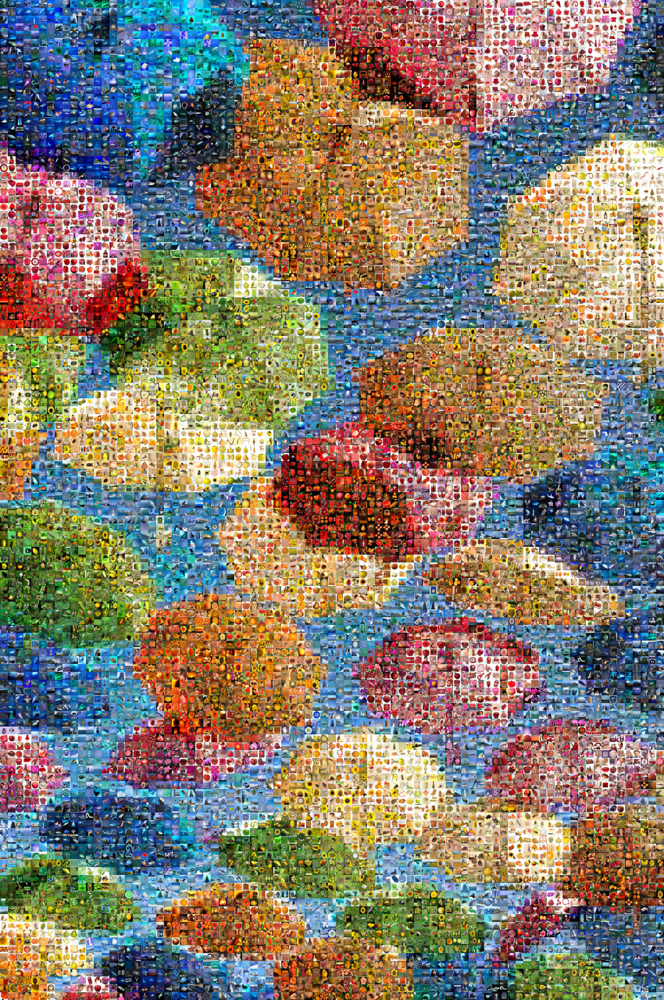

# Mosaic Maker

Create mosaics from thousands of unique images.

 ➡️ 

## Usage

```bash
streamlit run Mosaic_Maker.py
```

## Development

### Pre-commit

Run

```bash
pre-commit run --all-files
```

to run all pre-commit hooks, including style formatting and unit tests.

### Package management

Update [`requirements.in`](requirements.in) with new direct dependencies.

Then run

```bash
pip-compile requirements.in
```

to update the [`requirements.txt`](requirements.txt) file with all indirect and transitive dependencies.

Then run

```bash
pip install -r requirements.txt
```

to update your virtual environment with the packages.

## Acknowledgements

### Sample Images

- [`sample_images/umbrellas.jpg`](/sample_images/umbrellas.jpg) is a photo by [guy stevens](https://unsplash.com/@gstevens0884?utm_content=creditCopyText&utm_medium=referral&utm_source=unsplash) provided under the [Unsplash License](https://unsplash.com/license) on [Unsplash](https://unsplash.com/photos/person-taking-photo-of-assorted-color-umbrellas-dEGu-oCuB1Y?utm_content=creditCopyText&utm_medium=referral&utm_source=unsplash)
- [`sample_images/bouquet.jpg`](/sample_images/bouquet.jpg) is ["Bouquet of Flowers in a Vase"](https://www.getty.edu/art/collection/object/109JED) by [Georgius Jacobus Johannes van Os](https://www.getty.edu/art/collection/person/105J18) provided under [The J. Paul Getty Museum's Open Content Program](https://www.getty.edu/projects/open-content-program/).
