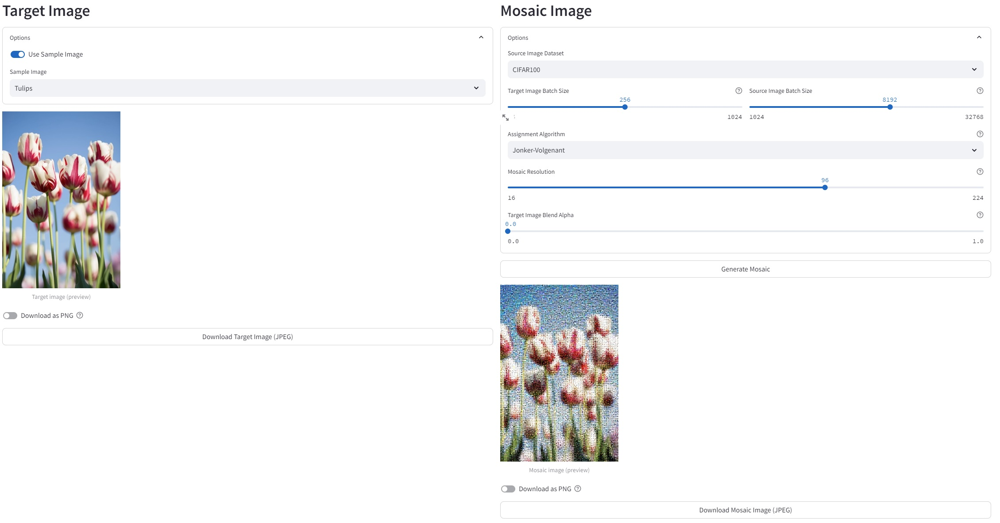

# Mosaic Maker

Create mosaics from thousands of unique images.

 ➡️ 

[View the example mosaic on Imgur in full quality](https://imgur.com/gallery/AUaAlhb)

## Usage

```bash
streamlit run Mosaic_Maker.py
```



*Note: Large mosaics require calculation and storage of large distance matrices, requiring moderately heavy CPU (~1 minute @ 100% CPU usage on an Intel i5-11300H @ 3.10GHz) and RAM usage (~8 GB) and hence this app may not be suitable for cloud without increased resource allocation. For example, the free tier of [Streamlit Community Cloud](https://streamlit.io/cloud) only offers 1GB guaranteed RAM availability as of March 10, 2024, which is not sufficient for this app.*

## Development

### Pre-commit

Run

```bash
pre-commit run --all-files
```

to run all pre-commit hooks, including style formatting and unit tests.

### Package management

Update [`requirements.in`](requirements.in) with new direct dependencies.

Then run

```bash
pip-compile requirements.in
```

to update the [`requirements.txt`](requirements.txt) file with all indirect and transitive dependencies.

Then run

```bash
pip install -r requirements.txt
```

to update your virtual environment with the packages.

## Acknowledgements

### Sample Images

- [`sample_images/umbrellas.jpg`](/sample_images/umbrellas.jpg) is an image by [Guy Stevens](https://unsplash.com/@gstevens0884?utm_content=creditCopyText&utm_medium=referral&utm_source=unsplash) provided under the [Unsplash License](https://unsplash.com/license) on [Unsplash](https://unsplash.com/photos/person-taking-photo-of-assorted-color-umbrellas-dEGu-oCuB1Y?utm_content=creditCopyText&utm_medium=referral&utm_source=unsplash)
- [`sample_images/tulips.jpg`](/sample_images/tulips.jpg) is an image by [Kwang Mathurosemontri](https://unsplash.com/@gemini_zucha89?utm_content=creditCopyText&utm_medium=referral&utm_source=unsplash) provided under the [Unsplash License](https://unsplash.com/license) on [Unsplash](https://unsplash.com/photos/shallow-focus-photography-of-white-and-pink-petaled-flowers-fY1ECB1RCd0?utm_content=creditCopyText&utm_medium=referral&utm_source=unsplash)
- [`sample_images/scuba.jpg`](/sample_images/scuba.jpg) is an image by [NEOM](https://unsplash.com/@neom?utm_content=creditCopyText&utm_medium=referral&utm_source=unsplash) provided under the [Unsplash License](https://unsplash.com/license) on [Unsplash](https://unsplash.com/photos/a-person-swimming-over-a-colorful-coral-reef-eNIGxtOdB10?utm_content=creditCopyText&utm_medium=referral&utm_source=unsplash)
- [`sample_images/abstract.jpg`](/sample_images/abstract.jpg) is an image by [Martin Katler](https://unsplash.com/@martinkatler?utm_content=creditCopyText&utm_medium=referral&utm_source=unsplash) provided under the [Unsplash License](https://unsplash.com/license) on [Unsplash](https://unsplash.com/photos/a-red-white-and-blue-abstract-background-S-Lm2lhayi0?utm_content=creditCopyText&utm_medium=referral&utm_source=unsplash)
- [`sample_images/bouquet.jpg`](/sample_images/bouquet.jpg) is ["Bouquet of Flowers in a Vase"](https://www.getty.edu/art/collection/object/109JED) by [Georgius Jacobus Johannes van Os](https://www.getty.edu/art/collection/person/105J18) provided under [The J. Paul Getty Museum's Open Content Program](https://www.getty.edu/projects/open-content-program/).

### Datasets

[CIFAR-10 and CIFAR-100](https://www.cs.toronto.edu/~kriz/cifar.html) are used for the source images via the [standard Torch loaders](https://pytorch.org/vision/main/datasets.html).
